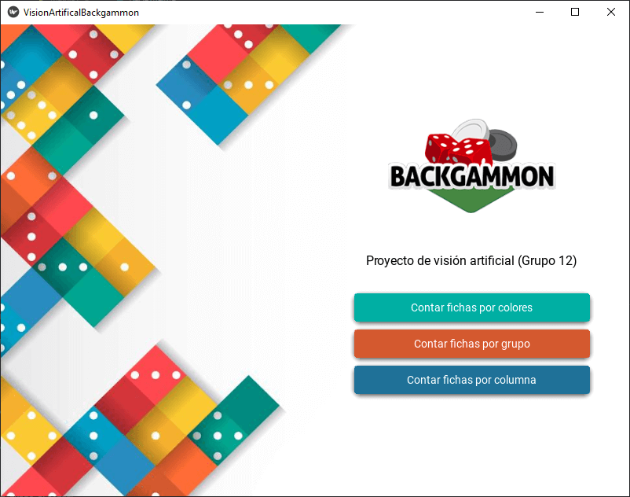
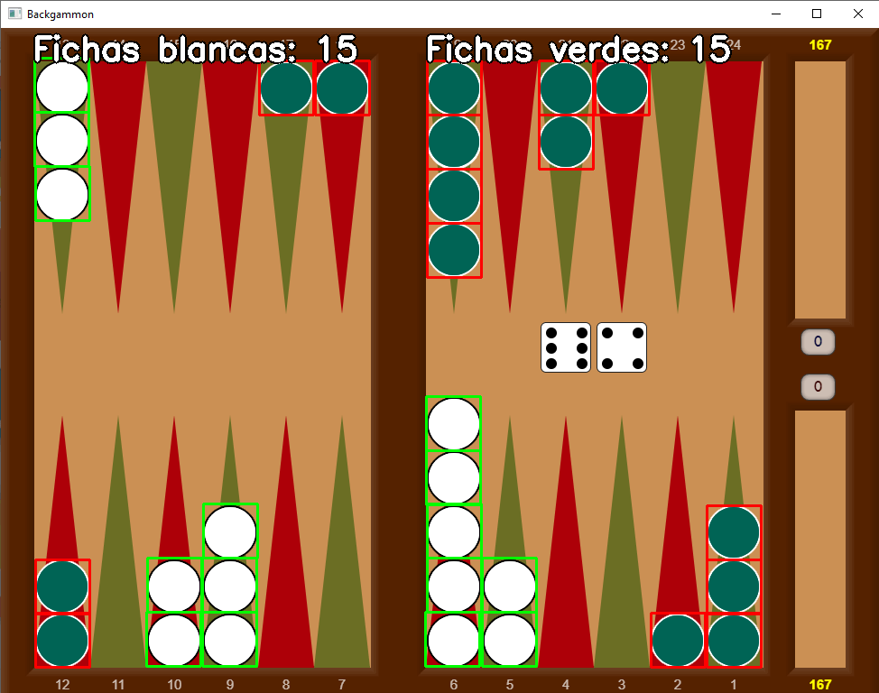
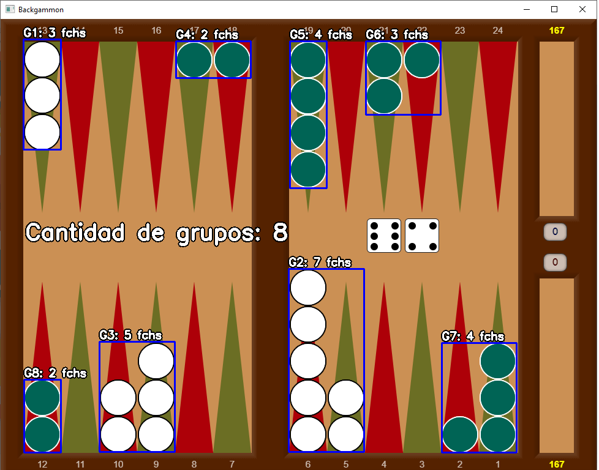
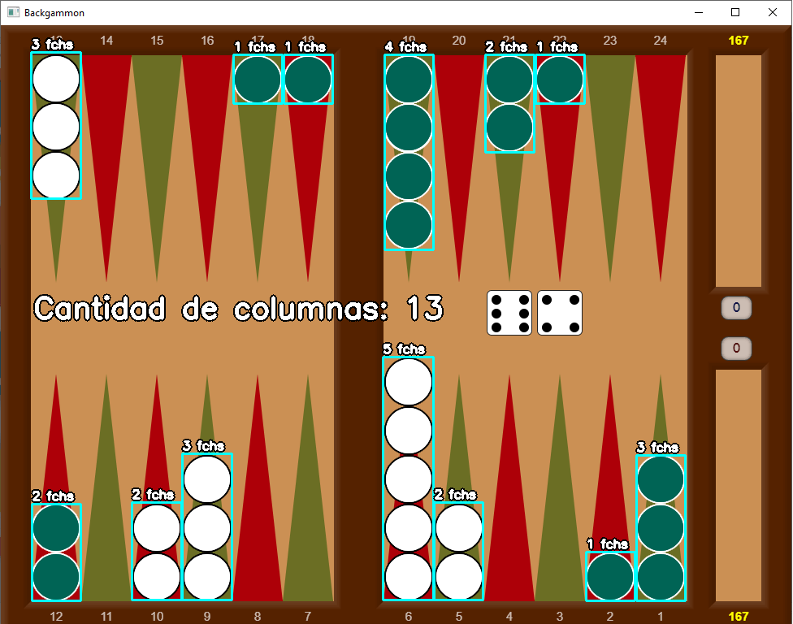

# Visión por computadora: contar fichas de backgammon
Diseño de Soluciones de Inteligencia Artificial - H51 

<small>Creación de un contador de fichas para un tablero de backgammon</small>

---

**Integrantes:**
- Andy Imanol Mnachego Montes
- Jersson Eduardo León Vilca 
- Ricardo Manuel Pelaez Limpi

## Librerías necesarias   
- Kivy
- KivyMD
- numpy
- openCV
  
`pip install -r requirements.txt`

## Características principales   

- Conteo de fichas for color    
  
- Conteo de fichas for grupos    
  
- Conteo de fichas for columnas    
  
